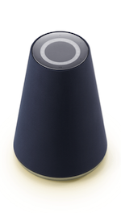

# Lights

A client device must provide lights to indicate the [Client states and events](/Design/Client_State_And_Event.md) and the feedback on user requests, etc. This section describes the lights that can be provided by the client and the guidelines for implementation.

* [Light colors](#LightColor)
* [Light effects](#LightEffect)
* [Light guidelines](#LightGuideline)

## Light colors {#LightColor}

The client must use the following colors of light:

| Light color     | RGB value                | Description                                   | Required |
|-------------|----------------------|---------------------------------------|:--------:|
| Green       | &#9724; 5, 214, 134(#05D686)   | Receipt of user audio input                                  | Required  |
| Yellow Green | &#9724; 150, 255, 0(#96FF00)    | Clova notification                             | Required  |
| Red         | &#9724; 255, 0, 0(#FF0000)      | Errors including mic mute, network connection error, or not enough battery     | Required  |
| Warm White   | &#9724; 240, 230, 230(#F0E6E6)  | Clova voice outputs and receipt of alarm/reminder/timer events through speaker                             | Required  |

The following image shows the implementation of light colors on Wave:

<table style="width:600px;">
  <thead>
    <tr>
      <th style="width:150px;">Green</th>
      <th style="width:150px;">Yellow Green</th>
      <th style="width:150px;">Red</th>
      <th style="width:150px;">Warm White</th>
    </tr>
  </thead>
  <tbody>
    <tr>
      <td></td>
      <td></td>
      <td></td>
      <td></td>
    </tr>
  </tbody>
</table>

## Light effects {#LightEffect}

Light effects are used for the purpose of delivering more details on the meaning or state in addition to the meaning delivered by the [Light colors](#LightColor).

The table below shows the light effects that must be expressed when implemented on a client device along with its descriptions and examples.

| Light effect                            | Description                                      | Example                                                               |
|------------------------------------|------------------------------------------|-------------------------------------------------------------------|
| Lights up                     | Switches directly to the light on state without any other effects.   |               |
| Repeat pulse         | Slowly brightens and dims the intensity of a light repeatedly. |   |
| Fade out                 | Slowly dims the intensity of light and eventually turns off. |              |
| Repeat splash          | Repeats the sideways rippling effect. |          |

The table below shows how to express the client device [states and events](/Design/Client_State_And_Event.md) using light.

| State or event               | Light effect                | Required |
|----------------------------|----------------------------|:---------:|
| Attending & listening state     | Turn on the Green light.              | Required     |
| End state                    | Slowly turn off the Warm White light.     | Required     |
| Error state                  | Slowly flicker the Red light repeatedly.       | Required     |
| Mute on state                | Turn on the Red light.                | Required     |
| Processing & reporting state | Slowly flicker the Warm White light repeatedly. | Required     |
| Disabling the mute on state            | Slowly turn off the Red light.           | Required     |
| Immediately after exceeding the wait time           | Slowly turn off the Green light.

<strong>Note!</strong>

Lighting effect on this event is scheduled to be removed from the implemented items if not mandatory anymore.

         | Optional     |
| Start alarm, reminder, or timer      | Repeat the rippling effect of the Warm White light.  | Optional     |

## Light guidelines {#LightGuideline}

The following guidelines must be followed when providing lights.
  - A person with an eyesight rating of 0.7 (decimal visual acuity) must be able to distinguish the [Light colors](#LightColor) within a distance of 1 meter.
  - For light colors, avoid applying states or meanings other than those that are predefined.
  - The light colors must be applied so that the user can perceive the graphic RGB color and the actual light color as the same.
  - In addition to the essential [Light effects](#LightEffect), you can add other light colors or effects depending on your UX policies or for appropriate situations, such as bootup, speaker volume controls, charging status, and button feedback.
  - It is recommended that you do not express too many meanings or states with a single light color or effect.
  - For screenless devices, it is recommended to indicate the level of the speaker volume by methods, such as brightness of lights.
  - For battery powered portable devices, it is recommended to implement the light effect so the information on the charging status can be gained from the light.
