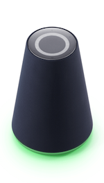
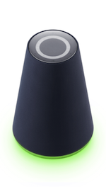
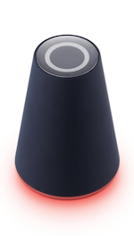

<!-- Note! This content includes shared parts. Therefore, when you update this file, you should beware of synchronization. -->

# クライアントデバイスのデザインガイドライン

Clovaが搭載されたクライアントデバイスを使用するユーザーに一貫したUI/UXを提供することで、ユーザーは混乱することなく便利に製品を使用することができます。そのため、Clovaに接続するクライアントデバイスを制作する際、以下の項目についてデザインガイドラインが提供されています。

* [クライアントの状態およびイベント](#ClientStateAndEvent)
* [ボタン](#Button)
* [ライト](#Light)
* [オーディオ](#Audio)
* [画面](#Screen)
* [Green Dot VUI](#GreenDotVUI)
* [Clovaインサイド](#ClovaInside)

  
<strong>ヒント</strong>

  
ここで言及されていないガイドラインや仕様は、メーカーの判断またはポリシーに基づいて実装してください。判断が難しい場合には、提携担当者までお問合せください。

## クライアントの状態およびイベント {#ClientStateAndEvent}

ユーザーの音声入力、Clovaの音声出力、マイクの状態、エラーの発生（Clovaサービスのエラー、ネットワークエラーなど）などをユーザーが容易に認知したり操作できるように、クライアントデバイスを設計・実装する必要があります。そのために、クライアントデバイスの状態、状態の遷移およびその流れをよく知っている必要があります。以下は、クライアントの状態を表した状態ダイアグラムです。

クライアントの各状態についての説明は以下の通りです。

| 状態                | 説明                                                            |
|------------------------|--------------------------------------------------------------------|
| Idle                   | クライアントで何の処理も行われていない                             |
| Attending              | クライアントがユーザーの音声入力を受信するために待機している                        |
| Listening              | クライアントがユーザーの音声入力を受信している                            |
| Processing & reporting | Clovaがユーザーの音声リクエストを処理しているか、またはスピーカーでClovaの音声を出力している |
| Error                  | システムエラーが発生している                                                |
| Mute on                | マイクがミュートに設定されている                                               |

上記で言及されている状態は、[ライト](#Light)、[効果音](#SoundEffect)、[画面](#Screen)などで表されます。状態の遷移は、ユーザーの音声や[ボタン](#Button)の操作、環境要因などによって実行されたり、発生したりします。

また、クライアントでは以下のイベントが発生することがあり、そのイベントも音声やライトで表現される必要があります。

| 名前               | 説明                                                           |
|------------------------|--------------------------------------------------------------------|
| アラーム（Alarm）             | 指定された日付と時間に鳴るアラーム                                           |
| リマインダー（Reminder）       | 指定された日付と時間に、ユーザーが入力した内容を表示したり、音声で再生しながら鳴るアラーム         |
| タイマー（Timer）            | 指定された時間が経過してから鳴るアラーム                                        |

## ボタン {#Button}

クライアントデバイスは、ユーザーが音声の代わりにデバイスを直接コントロールできるように、ボタンを提供する必要があります。クライアントがユーザーに提供できるボタンの種類と、実装する際に順守する内容を説明します。

* [ボタンの種類](#Buttons)
* [ボタンのガイドライン](#ButtonGuideline)

### ボタンの種類 {#Buttons}

クライアントデバイスは、以下のボタンを提供する必要があります。

| 名称                        | 説明                                                     | 必須/任意 |
|----------------------------|-------------------------------------------------------------|:---------:|
| 電源ボタン（Power）             | デバイスの電源をオン/オフします。                                        |       |
| マイクボタン（Mic mute）    | マイクを有効/無効にします。                                |       |
| 音量アップボタン（Volume up）       | スピーカーの音量を上げます。                                         |       |
| 音量ダウンボタン（Volume down）   | スピーカーの音量を下げます。                                          |       |
| 再生/一時停止ボタン（Play/Pause） | オーディオを一時停止/再生します。または、処理中の作業を中止します。         |       |
| 音声入力の聞き取りボタン（Wake up）   | ユーザーの音声入力を聞き取るモード（attending状態）に切り替わります。ユーザーが「Clova」と話しかけるのと同じ動作です。 | 任意      |
| Wi-Fiボタン（Wi-Fi）          | Wi-Fiネットワークに接続したり、接続を解除します。                                 | 任意      |
| Bluetoothボタン（Bluetooth）     | Bluetoothデバイスとペアリング/接続/解除します。                              | 任意      |
| リセットボタン（Reset）          | デバイスをリセットします。                                              | 任意      |

### ボタンのガイドライン {#ButtonGuideline}

ボタンを提供する際に、以下の内容を順守する必要があります。

* 電源ボタンとマイクボタンは、物理ボタンで提供することを推奨します。
* 電源ボタンとマイクボタン以外のボタンは、物理ボタンまたはタッチ式のUIボタンなど、メーカーのポリシーに合わせてさまざまな形で提供することができます。
* 頻繁に操作する主要ボタンは、操作のしやすさのために、前面または上部に配置することを推奨します。
* タッチ式のUIボタンを提供する場合、ユーザーが手を離すとき（touch release）に、定義されたアクションを実行する必要があります。
* あらかじめ定義されたボタンの組み合わせがない場合、2つ以上のボタン入力が同時に行われると、先に認識されたボタン入力の機能のみを処理する必要があります。
* ボタン入力ですでに作業を処理しているときに新規のボタン入力がある場合、前の作業に対するフィードバック効果を中止し、新規のボタン入力に対するフィードバック効果を提供する必要があります。
* UI画面が提供されているデバイスに限って、再生/一時停止ボタンをGUIボタンで提供することが可能です。
* ボタンは、以下の方法で提供できます。
  - 1つの機能のための単独のボタンを提供する（例：Bluetoothボタンを単独で提供する）
  - ボタンの長押し操作を利用して機能を提供する（例：電源ボタンを長押ししてリセットする機能を提供する）
  - 2つ以上のボタンの組み合わせを利用して機能を提供する（例：電源ボタンと再生ボタンを同時に押してリセットする機能を提供する）

## ライト {#Light}

クライアントデバイスは、[クライアントの状態およびイベント](#ClientStateAndEvent)や、ユーザーのリクエストに対するフィードバックなどを表現するためにライトを提供する必要があります。クライアントがユーザーに提供すべきライトについて説明します。

* [ライトの色](#LightColor)
* [照明効果](#LightEffect)
* [ライトのガイドライン](#LightGuideline)

### ライトの色 {#LightColor}

クライアントは、次のようなライトの色を使用する必要があります。

| ライトの色     | RGB値                | 説明                                   | 必須/任意 |
|-------------|----------------------|---------------------------------------|:--------:|
| Green       | &#9724; 5, 214, 134(#05D686)   | ユーザーの音声入力を聞き取っている                                  |   |
| Yellow Green | &#9724; 150, 255, 0(#96FF00)    | Clova通知（Notification）                             |   |
| Red         | &#9724; 255, 0, 0(#FF0000)      | マイクのミュート、ネットワーク接続エラー、バッテリー不足などのエラー状況     |   |
| Warm White   | &#9724; 240, 230, 230(#F0E6E6)  | スピーカーによるClovaの音声出力、アラーム/リマインダー/タイマーイベントの受信                             |   |

以下は、Waveのライトの事例です。

<table style="width:600px;">
  <thead>
    <tr>
      <th style="width:150px;">Green</th>
      <th style="width:150px;">Yellow Green</th>
      <th style="width:150px;">Red</th>
      <th style="width:150px;">Warm White</th>
    </tr>
  </thead>
  <tbody>
    <tr>
      <td></td>
      <td></td>
      <td></td>
      <td></td>
    </tr>
  </tbody>
</table>

### 照明効果 {#LightEffect}

照明効果は、[ライトの色](#LightColor)が伝える意味に基づいて、もっと詳しい意味や状態を伝えるために使用されます。

以下の表は、クライアントデバイスを実装するときに、ライトが表すべきライト効果と、それについての説明およびサンプルを提供します。

| 照明効果                            | 説明                                      | サンプル                                                               |
|------------------------------------|------------------------------------------|-------------------------------------------------------------------|
| 点灯する（Lights up）                     | 特別な効果なしに、ライトを点灯した状態に切り替わります。   |               |
| ゆっくりと点滅を繰り返す（Repeat pulse）         | ライトの照度をゆっくりと上げたり下げたりすることを繰り返します。 |   |
| ゆっくりと消灯する（Fade out）                 | ライトの照度をゆっくりと下げて、最後にライトを消します。 |              |
| 波の表現を繰り返す（Repeat Splash）          | ライトが左右に波を打つような効果を繰り返します。 |          |

以下の表は、クライアントの[状態およびイベント](#ClientStateAndEvent)をライトで表現する方法を示します。

| 状態またはイベント               | 照明効果適用                | 必須/任意 |
|----------------------------|----------------------------|:---------:|
| Attending、listening状態     | Greenのライトを点灯する              |      |
| End状態                    | Warm Whiteのライトをゆっくりと消灯する     |      |
| Error状態                  | Redのライトの点滅をゆっくりと繰り返す       |      |
| Mute on状態                | Redのライトを点灯する                |      |
| Processing & reporting状態 | Warm Whiteのライトの点滅をゆっくりと繰り返す |      |
| Mute on状態の解除            | Redのライトをゆっくりと消灯する           |      |
| 待機時間が超過した直後           | Greenのライトをゆっくりと消灯する

<strong>メモ</strong>

このイベントに対する照明効果はもう必須の実装項目ではなく、実装項目から削除される予定です。

         | 任意     |
| アラーム、リマインダー、タイマーの開始      | Warm Whiteのライトが波の表現を繰り返す  | 任意     |

### ライトのガイドライン {#LightGuideline}

ライトを提供する際に、以下の内容を順守する必要があります。
  - 1メートル以内の距離で、0.7の視力を持つ人が[ライトの色](#LightColor)を区別する必要があります。
  - ライトの色に定義されている意味以外の状態や意味を適用しないことを推奨します。
  - ライトの色は、ユーザーがRGB値と同一の色であると認知できるように適用する必要があります。
  - 必ず表現すべき[照明効果](#LightEffect)以外にも、デバイスの起動、スピーカーの音量調節、充電状態、ボタンのフィードバックなど、状況に合わせて、またメーカーのUXポリシーに合わせて、ライトの色と効果を追加することができます。
  - 1つのライトの色や効果で、あまり多くの意味や状態を表現しないことを推奨します。
  - 画面が提供されないデバイスは、ライトの明るさなどでデバイスのスピーカー音量のレベルを表示することを推奨します。
  - 移動できるバッテリー搭載のモデルは、バッテリーの充電状態をライトで確認できるように実装することを推奨します。

## オーディオ {#Audio}

クライアントデバイスでオーディオコンテンツ、効果音などを出力する際に順守するべき内容を説明します。

* [オーディオ再生の基本ルール](#AudioInterruptionRule)
* [ユーザー発話時のオーディオ再生ルール](#AudioInterruptionRuleForUserUtterance)
* [効果音](#SoundEffect)
* [プラットフォームでサポートされるオーディオ圧縮形式](#SupportedAudioCompressionFormat)

### オーディオ再生の基本ルール {#AudioInterruptionRule}

クライアントは、オーディオコンテンツの再生中に、別のオーディオコンテンツの再生を要求される場合があります。そのとき、クライアントは、オーディオ再生ルールに従ってオーディオコンテンツを再生する必要があります。オーディオ再生ルールは、オーディオコンテンツのタイプを基準に作成されています。なので、再生ルールの前に、まずオーディオコンテンツのタイプについて知る必要があります。オーディオコンテンツのタイプには、以下のようなものがあります。クライアントは、オーディオコンテンツのタイプに関連するCIC APIの名前空間に基づいて、Clovaから受信するオーディオコンテンツを区別する必要があります。

| オーディオコンテンツのタイプ | 説明                                                  | 関連するCIC APIの名前空間             |
|---------------|-------------------------------------------------------|----------------------------------|
| Alert         | アラーム音、タイマー音、リマインダー音、リマインダー発話、緊急の警報音などのオーディオコンテンツ             | [`Alerts`](/Develop/References/CICInterface/Alerts.md) |
| Content       | ユーザーのリクエストに対する音楽、動画、ニュース、ポッドキャストなどのオーディオコンテンツ                           | [`AudioPlayer`](/Develop/References/CICInterface/AudioPlayer.md) |
| Dialogue      | ユーザーのリクエストに対するTTSオーディオコンテンツ                                                  | [`SpeechRecognizer`](/Develop/References/CICInterface/SpeechRecognizer.md), [`SpeechSynthesizer`](/Develop/References/CICInterface/SpeechSynthesizer.md) |
| Feedback      | リセット音、着信音（ring tone）、呼び出し音（ringback tone）                              | なし（クライアントで判断する） |
| Notification  | 発信音、システム状態の発話（バッテリー不足の通知、Bluetooth接続解除の通知など）、通知音、通知発話         | [`Notifier`](/Develop/References/CICInterface/Notifier.md) |

  
<strong>メモ</strong>

  
Alertとnotificationタイプは、効果音と発話をまとめて1つのオーディオコンテンツとして扱う必要があります。例えばリマインダーの場合、リマインダー音とリマインダー発話を1つのアラートオーディオコンテンツとして扱う必要があります。同じくバッテリー不足の通知の場合、発信音と「バッテリーが不足しています」のようなシステム状態の発話を、1つのnotificationオーディオコンテンとして扱う必要があります。

以下のオーディオ再生ルールがあります。

* 物理ボタンの効果音はすぐに再生される必要があります。そのために、ミキシング方式で効果音を出力します。
* オーディオコンテンツは、すぐに再生される必要があります。再生中のオーディオコンテンツがある場合、それをバックグラウンドに処理し、新規のオーディオコンテンツを再生する必要があります。
* ただし、再生中のオーディオコンテンツと新規のオーディオ[コンテンツのタイプ](#AudioInterruptionRule)が同じ場合には、次のように処理します。
  - **Alert、Content、Dialogue、Feedbackタイプ**：再生中のオーディオコンテンツを中断（cancel）し、新規のオーディオコンテンツを再生します。
  - **Notificationタイプ**：現在再生中のオーディオコンテンツを引き続き再生し、新規のオーディオコンテンツを再生キューに追加します。再生中のオーディオコンテンツの再生を完了してから、再生キューに入っている順序通りにオーディオコンテンツを再生します。
* オーディオ再生を停止するときは、現在再生中のオーディオコンテンツから中断する必要があります。

以下は、上記のルールに基づいて、オーディオコンテンツのタイプによって再生中のオーディオコンテンツを処理する方法を示します。

<table style="text-align:center">
  <thead>
    <tr>
      <th rowspan="2">再生中のタイプ</th><th colspan="5">新規に再生するタイプ</th><th rowspan="2">物理ボタンの効果音</th>
    </tr>
    <tr>
      <th>Alert</th><th>Content</th><th>Dialogue</th><th>Feedback</th><th>Notification</th>
    </tr>
  </thead>
  <tbody>
    <tr>
      <th>Alert</th>
      <td>再生中断</td>
      <td>バックグラウンド処理</td>
      <td>バックグラウンド処理</td>
      <td>バックグラウンド処理</td>
      <td>バックグラウンド処理</td>
      <td rowspan="5">ミキシング処理</td>
    </tr>
    <tr>
      <th>Content</th>
      <td>バックグラウンド処理</td>
      <td>再生中断</td>
      <td>バックグラウンド処理</td>
      <td>バックグラウンド処理</td>
      <td>バックグラウンド処理</td>
    </tr>
    <tr>
      <th>Dialogue</th>
      <td>バックグラウンド処理</td>
      <td>バックグラウンド処理</td>
      <td>再生中断</td>
      <td>バックグラウンド処理</td>
      <td>バックグラウンド処理</td>
    </tr>
    <tr>
      <th>Feedback</th>
      <td>バックグラウンド処理</td>
      <td>バックグラウンド処理</td>
      <td>バックグラウンド処理</td>
      <td>再生中断</td>
      <td>バックグラウンド処理</td>
    </tr>
    <tr>
      <th>Notification</th>
      <td>バックグラウンド処理</td>
      <td>バックグラウンド処理</td>
      <td>バックグラウンド処理</td>
      <td>バックグラウンド処理</td>
      <td>引き続き再生（キューに追加）</td>
    </tr>
  </tbody>
</table>

### ユーザー発話時のオーディオ再生ルール {#AudioInterruptionRuleForUserUtterance}

クライアントがオーディオコンテンツを再生している途中に、ユーザーが音声入力をしようとする場合、以下のルールに従う必要があります。

* 再生中のオーディオコンテンツがある場合、attending状態からprocessing & reporting状態まで、そのオーディオをバックグラウンドで処理します。
* 音声入力の待機時間を超過したり、ユーザーのリクエストを正常に処理できなかった場合、バックグラウンド処理したオーディオコンテンツを元通りに再生します。
* リクエストの処理結果によって、別のオーディオコンテンツを再生する必要がある場合、[オーディオ再生の基本ルール](#AudioInterruptionRule)に従ってオーディオコンテンツを再生します。
* マルチターンの対話を行う際、追加的にlistening、processing & reportingとなる状態でも上記のルールに従います。

ユーザーの音声入力を聞き取るattending、listening状態で、新規のオーディオコンテンツ再生のリクエストが入ると、次のように処理します。

* **Alert/dialogue/content**タイプのオーディオコンテンツを再生する場合、ユーザーの音声入力の聞き取りをキャンセルして、そのオーディオコンテンツを再生します。
* **Notification**タイプや**Feedback**タイプのオーディオコンテンツを再生する場合、そのオーディオコンテンツをバックグラウンドで再生します。

### 効果音 {#SoundEffect}

クライアントは、デバイスの状態やユーザーのリクエストに対するフィードバックなどを表現するために、[ライト](#Light)と一緒に効果音を提供する必要があります。クライアントがユーザーに提供すべき効果音の種類と状況を説明します。

* [効果音の種類](#SoundEffects)
* [効果音のガイドライン](#SoundEffectGuideline)

#### 効果音の種類 {#SoundEffects}

クライアントの[状態およびイベント](#ClientStateAndEvent)を表現するために、以下のような効果音を提供する必要があります。

| 状態またはイベント              | 効果音のサンプル                     | 必須/任意 |
|---------------------------|------------------------------|:---------:|
| Attending状態になる         | <audio title="Attending" controls><source src="./Assets/Sounds/Clova-Client-Soundeffect-Attending.wav" type="audio/wav" /></audio> | 任意     |
| Error状態になる             | <audio title="Error" controls><source src="./Assets/Sounds/Clova-Client-SoundEffect-Error.wav" type="audio/wav" /></audio>         |      |
| Mute on状態になる           | <audio title="Mute on" controls><source src="./Assets/Sounds/Clova-Client-SoundEffect-Mute_On.wav" type="audio/wav" /></audio>     |      |
| Mute on状態の解除           | <audio title="Mute off" controls><source src="./Assets/Sounds/Clova-Client-SoundEffect-Mute_Off.wav" type="audio/wav" /></audio>   |      |
| アラーム（イベントが発生したときに、効果音をリピート再生する） | <audio title="Alarm" controls><source src="./Assets/Sounds/Clova-Client-SoundEffect-Alarm.wav" type="audio/wav" /></audio>         |      |
| リマインダー（イベントが発生したときに、効果音とリマインダー内容のTTSの順序にリピート再生する） | <audio title="Reminder" controls><source src="./Assets/Sounds/Clova-Client-SoundEffect-Reminder.wav" type="audio/wav" /></audio>         |      |
| タイマー（イベントが発生したときに、効果音をリピート再生する）      | <audio title="Timer" controls><source src="./Assets/Sounds/Clova-Client-SoundEffect-Timer.wav" type="audio/wav" /></audio>         |      |

#### 効果音のガイドライン {#SoundEffectGuideline}

効果音を提供する際に、以下の内容を順守する必要があります。

* 提供されている効果音をそのまま使用することを推奨します。
* 提供されている効果音以外にも、状況またはメーカーのUXポリシーに合わせて、効果音を追加することができます。
* ユーザーが音だけで状況を認知できるようにする必要があります。
* 照明効果や画面の状況に合わせて、一貫した効果音を提供する必要があります。
* ボタンのフィードバックに対する効果音を提供する場合、ボタンの物性と感触にマッチする効果音を提供する必要があります。

### プラットフォームでサポートされるオーディオ圧縮形式 {#SupportedAudioCompressionFormat}

<!-- Start of the shared content: SupportedAudioCompressionFormat -->

クライアントはClovaから送信されるストリームを再生するので、Clovaでサポートされているオーディオ圧縮形式を再生できる必要があります。

Clovaでは、以下のオーディオ圧縮形式がサポートされています。

| オーディオ圧縮形式                     | ファイルの拡張子 | ライセンス費用 |
|----------------------------------|:--------: |---------|
| MPEG-1 or MPEG-2 Audio Layer III | .mp3     | 無料       |

  
<strong>ヒント</strong>

  
Clovaでサポートされるオーディオ圧縮形式は、さらに増える可能性があります。

<!-- End of the shared content -->

## 画面 {#Screen}

クライアントのディスプレイ装置で、画面に以下のUI項目を提供する必要があります。

* [起動画面](#BootingScreen)
* [ロゴの表示](#DisplayingLogo)
* [Green Dot VUI](#GreenDotVUI)

### 起動画面 {#BootingScreen}

デバイスをオンにして、起動が完了するまで表示される画面です。起動画面には主にロゴが表示されます。Clovaのロゴは、他のロゴと組み合わせることなく、単独で画面に表示します。また、ロゴは同じサイズと比率で表示する必要があります。

 

### ロゴの表示 {#DisplayingLogo}

画面のレイアウトによってClovaのロゴを配置する方法について説明します。

* [レイアウトA](#LayoutA)
* [レイアウトB](#LayoutB)
* [レイアウトC](#LayoutC)

#### レイアウトA {#LayoutA}

画面下の一部や全体を覆うUI画面で、Clovaのロゴが左上に配置されます。

 

* Clovaのロゴは、左上に配置される必要があります。
* Clovaのロゴは、透明にしない必要があります。

#### レイアウトB {#LayoutB}

[レイアウトA](#LayoutA)と似たようなレイアウトです。画面下の一部や全体を覆うUI画面で、Clovaのロゴが右上に配置されます。

 

* Clovaのロゴは、右上に配置される必要があります。
* Clovaのロゴは、透明にしない必要があります。

#### レイアウトC {#LayoutC}

テキスト形式の結果を表現する画面で、Clovaのロゴが上部に配置されるレイアウトです。

* Clovaのロゴは、上部に配置される必要があります。
* コンテンツの提供元は、コンテンツの下に表示される必要があります。

### Green Dot VUI {#GreenDotVUI}

Green Dot VUIはClovaの音声検索ツールで、アイデンティティを表すUIデザインです。Green Dot VUIは、ユーザー音声の聞き取り、Clova音声出力など、Clova音声動作に関連する状態を表します。

画面があるクライアントデバイスは、Green Dot VUIを表現する必要があります。ここでは、Green Dot VUIで使用される色やクライアントの状態による表現方法を説明します。

* [Green Dot VUIの色](#GreenDotVUIColor)
* [Green Dot VUIの表現](#GreenDotVUIMotions)

#### Green Dot VUIの色 {#GreenDotVUIColor}

Green Dot VUIは、3つの色のグラデーションをリングの形で表現する必要があります。

以下は、上図で使用されている3色の詳細です。

| 色の名称        | RGB値       | CMYK値     | PANTONEカラー   |
|----------------|-------------|-------------|-------------|
| Greendot Green | &#9724; 3, 235, 100(#03EB64) | 60, 0, 75, 0   | 2270C |
| Greendot Mint  | &#9724;20, 230, 190(#14E6BE) | 50, 0, 25, 0   | 3255C |
| Greendot Blue  | &#9724;30, 200, 235(#1EC8EB) | 70, 5, 0, 0   |  298C |

#### Green Dot VUIのアクション {#GreenDotVUIMotions}

Green Dot VUIのUI表現はアクションごとに異なります。以下の表は、Green Dot VUIの動作を説明しています。

| アクション名称        | 説明                           | UIモーション（Motion） |
|----------------|-------------------------------|---------------|
| 準備（Intro）          | ユーザーがウェイクワードを言ったり、ボタンを操作したときに表示されるモーション         |       |
| 待機（Waiting）        | ユーザーの音声が実際に入力されるまで表示されるモーション         |     |
| 入力（Speaking）      | ユーザーの音声が実際に認識され、入力されているときに表示されるモーション |     |
| 解析/処理（Processing） | ユーザーのリクエストを解析し、処理しているときに表示されるモーション       |  |
| 応答（Answering）      | ユーザーのリクエストに対する応答をTTSで出力しているときに表示されるモーションこのモーションには、次の3つの区間があります。<ul><li>エントリ区間：応答（TTS）が開始することを表します（フレーム1~13）。</li><li>リピート区間：TTS出力していることを表します（フレーム14~29）。応答が完了するまで、この区間を繰り返して再生する必要があります。</li><li>終了区間：応答が終了することを表します（フレーム30~41）。</li></ul>    |   |
| 完了（Complete）       | ユーザーのリクエストに対する応答を完了するときに表示されるモーション            |   |
| エラー（Error）          | エラーが発生している                                       |      |

  
<strong>メモ</strong>

  
Green Dot VUIモーションのフレームレートは30fpsである必要があります。

ユーザーの動作や[クライアントの状態](#ClientStateAndEvent)遷移に応じてGreen Dot VUIの動作を表現する必要があります。以下では、状態ごとにGreen Dot VUIを表現するルールを説明します。

* ユーザーがウェイクワードを言ったり、ボタンを押して**Attending**状態に入ると、**準備**モーションを再生します。
* **準備**モーションを1回再生し、マイクからユーザーの音声入力が実際に開始されるまで**待機**モーションを繰り返して再生します。
* ユーザーの音声入力が開始され、クライアントが**Listening**状態に入ると、ユーザーの音声入力が終了するまで**入力**モーションを繰り返して再生します。
* ユーザーの入力が終了し、クライアントが**Processing & reporting**状態に入ると、応答を出力するか、結果画面を表示するまで**解析/処理**モーションを繰り返して再生します。
* 応答（TTS）を出力するときは、**応答**のエントリ区間を1回再生し、応答が終わるまでリピート区間を繰り返して再生します。応答が終了すると、終了区間を1回再生します。
* 応答を出力する際、**応答**モーションを区分して表示できない場合には、リピート区間のみ繰り返して再生します。
* ユーザーのリクエストに対して必要な作業をすべて処理し、クライアントが**Idle**状態に入ると、**完了**モーションを1回再生します。

以下は、Green Dot VUIモーションのサンプルです。

  
<strong>メモ</strong>

  
Green Dot VUIのモーション画像が必要な場合、Clova事務局までお問い合わせください。

## Clovaインサイド {#ClovaInside}
Clovaインサイドは、特定の製品にClovaの技術が搭載されていることを示すブランド要素です。適用対象や環境の特性に基づいて、印刷媒体などの対象に正しく表示される必要があります。

そのために、ここでは以下の内容を説明します。

* [Clovaインサイドバッジ](#ClovaInsideBadge)
* [Clovaインサイドの色](#ClovaInsideColor)
* [Clovaインサイドの背景色](#ClovaInsideBackgroundColor)
* [Clovaインサイドに関するガイドライン](#ClovaInsideRules)

### Clovaインサイドバッジ {#ClovaInsideBadge}
Clovaインサイドバッジは、次の2つの種類があります。

| 基本タイプ                                                        | テキストタイプ                                                      |
|:-----------------------------------------------------------: |:-----------------------------------------------------------:|
|   |   |

Clovaインサイドバッジのタイプごとに、形と大きさの基準があります。以下は、**基本タイプ**のバッジの基準です。
* バッジの周囲に、バッジの高さの3分の1に相当する余白を設ける必要があります。
* バッジの高さは、印刷物で6mm以上、画面上で17px以上にする必要があります。

以下は、**テキストタイプ**のバッジの基準です。

* バッジの周囲に、バッジの高さに相当する余白を設ける必要があります。
* バッジの高さは、印刷物で2.1mm以上、画面上で6px以上にする必要があります。

  
<strong>メモ</strong>

  
Clovaインサイドバッジは、提供されたそのままの状態で使用してください。バッジを任意に作成することはできません。Clovaインサイドの画像が必要な場合、Clova事務局までお問い合わせください。

### Clovaインサイドの色 {#ClovaInsideColor}
Clovaインサイドバッジと背景色は、次の4つから1つを使用してください。

以下は、上図で使用されている4色の詳細です。

| 色の名称        | RGB値       | CMYK値     | PANTONEカラー   |
|----------------|-------------|-------------|-------------|
| Clovaグリーン    | &#9724;  5, 214, 134(#05D686) | 70,  0, 60,  0 | 3395C |
| Clovaブラック    | &#9724; 30,  30,  30(#1E1E1E) |  0,  0,  0, 90 | <!-- --> |
| Clovaグレー     | &#9724;177, 177, 177(#B1B1B1) |  0,  0,  0, 50 | Coolgrey 5C |
| Clovaホワイト    | &#9724;255, 255, 255(#FFFFFF) |  0,  0,  0,  0 | <!-- --> |

### Clovaインサイドの背景色 {#ClovaInsideBackgroundColor}

[Clovaインサイドバッジ](#ClovaInsideBadge)を適用する際、最初にバッジの背景色を決める必要があります。デバイス・パッケージの素材などの環境や条件によって、[Clovaインサイドの色](#ClovaInsideColor)から適切な色を1つ選択します。Clovaインサイドの背景色とバッジの色は、以下の組み合わせから1つを使用してください。

  
<strong>メモ</strong>

  
バッジと背景色を決めるとき、Clovaグリーンが使用されている組み合わせを優先的に使用することを推奨します。スポットカラー印刷を適用できない場合には、モノクロの組み合わせを使用してください。

### Clovaインサイドに関するガイドライン {#ClovaInsideRules}

Clovaインサイドを適用する際、以下のガイドラインに従ってください。

<ul>
  <li>Clovaインサイドを表現するときは、提供された<a href="#ClovaInsideBadge">Clovaインサイドバッジ</a>を使用してください。</li>
  <li>Clovaインサイドバッジと背景色は、指定された<a href="#ClovaInsideColor">色</a>と<a href="#ClovaInsideBackgroundColor">背景色</a>の組み合わせを使用してください。
  <li><a href="#ClovaInsideBadge">Clovaインサイドバッジ</a>の余白と大きさの基準に従ってください。</li>
  <li>デバイスに適用する場合には、<strong>テキストタイプ</strong>のバッジを使用することを推奨します。以下は、デバイスに<strong>テキストタイプ</strong>のClovaインサイドバッジが適用されたサンプルです。 
    
  </li>
  <li>製品のパッケージなどに適用する場合には、<strong>基本タイプ</strong>のバッジを使用することを推奨します。以下は、製品のパッケージに<strong>基本タイプ</strong>のClovaインサイドバッジが適用されたサンプルです。 
    
  </li>
  <li>製品のパッケージに適用する場合、以下のように説明のフレーズを組み合わせて使用することを推奨します。
    <ul>
      <li>バッジとフレーズを横方向に組み合わせた場合です。 
        
      </li>
      <li>バッジとフレーズを縦方向に組み合わせた場合です。 
        
      </li>
    </ul>
  </li>
</ul>
