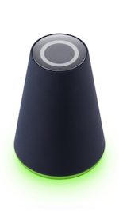
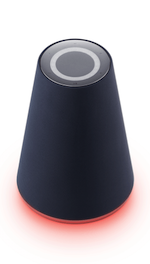
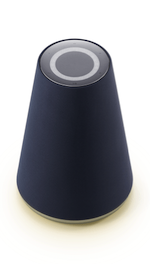

<!-- Note! This content includes shared parts. Therefore, when you update this file, you should beware of synchronization. -->

# 클라이언트 기기 디자인 가이드라인

Clova가 탑재된 클라이언트 기기를 사용하는 사용자에게 일관된 UI/UX를 제공해야 사용자가 제품을 사용할 때 혼란을 느끼지 않고 편리하게 사용할 수 있습니다. 이를 위해 Clova에 접속하는 클라이언트 기기를 만들 때 다음과 같은 항목에 대해 디자인 가이드라인을 제공하고 있습니다.

* [클라이언트 상태 및 이벤트](#ClientStateAndEvent)
* [버튼](#Button)
* [조명](#Light)
* [소리](#Audio)
* [화면](#Screen)

  
<strong>Tip!</strong>

  
여기에서 언급되지 않은 가이드라인이나 스펙은 제조사의 재량이나 정책에 맞게 구현하시면 됩니다. 만약, 직접 판단하기 힘든 부분이 있다면 제휴 담당자에게 연락하시기 바랍니다.

## 클라이언트 상태 및 이벤트 {#ClientStateAndEvent}

사용자 음성 입력, Clova 음성 출력, 마이크 상태, 오류 발생(Clova 서비스 오류, 네트워크 오류 등) 등을 사용자가 쉽게 인지하거나 조작할 수 있도록 클라이언트 기기를 설계하거나 구현해야 합니다. 이를 위해 클라이언트 기기가 가지는 상태와 상태 사이의 동작 및 흐름을 이해해야 합니다. 다음은 클라이언트의 상태를 표현한 상태 다이어그램입니다.

클라이언트의 각 상태에 대한 설명은 다음과 같습니다.

| 상태 이름                | 상태 설명                                                            |
|------------------------|--------------------------------------------------------------------|
| Idle                   | 클라이언트가 아무런 작업도 수행하고 있지 않은 상태                             |
| Attending              | 클라이언트가 사용자의 음성 입력을 수신하려고 대기하는 상태                        |
| Listening              | 클라이언트가 사용자의 음성 입력을 수신하는 중인 상태                            |
| Processing & reporting | Clova가 사용자의 음성 요청을 처리 중이거나 스피커를 통해 Clova 음성을 출력 중인 상태 |
| Error                  | 시스템 오류가 발생한 상태                                                |
| Mute on                | 마이크 음소거를 설정한 상태                                               |

위에서 언급된 상태는 [조명](#Light), [효과음](#SoundEffect), [화면](#Screen) 등을 통해 표현될 수 있으며, 상태 사이의 전이 동작은 사용자의 음성이나 [버튼](#Button) 조작, 환경 요인 등으로 실행되거나 발현될 수 있습니다.

또한, 클라이언트에서 다음과 같은 이벤트가 발생할 수 있으며, 이 이벤트도 소리나 조명으로 표현해야 합니다.

| 이벤트 이름               | 이벤트 설명                                                           |
|------------------------|--------------------------------------------------------------------|
| 알람(Alarm)             | 지정한 날짜와 시간에 울리는 알람                                           |
| 리마인더(Reminder)       | 지정한 날짜와 시간에 사용자가 입력한 내용을 표시하거나 들려주면서 울리는 알람         |
| 타이머(Timer)            | 지정한 시간이 경과한 후 울리는 알람                                        |

## 버튼 {#Button}

클라이언트 기기는 사용자가 음성 대신 직접 기기를 제어할 수 있도록 버튼을 제공해야 합니다. 클라이언트가 사용자에게 어떤 버튼을 제공할 수 있는지 그리고 구현할 때 어떤 사항을 지켜야 하는지 설명합니다.

* [버튼 종류](#Buttons)
* [버튼 가이드라인](#ButtonGuideline)

### 버튼 종류 {#Buttons}

클라이언트 기기는 다음과 같은 버튼을 제공해야 합니다.

| 이름                        | 기능 설명                                                     | 필수 여부 |
|----------------------------|-------------------------------------------------------------|:---------:|
| 전원 버튼(Power)             | 기기 전원을 켜거나 끕니다.                                        | 필수      |
| 마이크 음소거 버튼(Mic mute)    | 마이크를 활성화하거나 비활성화합니다.                                | 필수      |
| 볼륨 업 버튼(Volume up)       | 스피커의 볼륨을 높입니다.                                         | 필수      |
| 볼륨 다운 버튼(Volume down)   | 스피커의 볼륨을 낮춥니다.                                          | 필수      |
| 재생/일시정지 버튼(Play/Pause) | 음악을 중지하거나 다시 재생합니다. 또는 진행 중인 작업을 중지합니다.         | 필수      |
| 음성 입력 수신 버튼(Wake up)   | 사용자의 음성 입력을 수신하는 모드(attending 상태)로 전환합니다. 이는 사용자가 "클로바"라고 말하는 것과 같은 동작입니다. | 선택      |
| 무선랜 버튼 (Wi-Fi)          | 무선 네트워크를 연결하거나 해제합니다.                                 | 선택      |
| 블루투스 버튼 (Bluetooth)     | 블루투스 기기를 페어링/연결/해제 합니다.                              | 선택      |
| 초기화 버튼 (Reset)          | 기기를 초기화합니다.                                              | 선택      |

### 버튼 가이드라인 {#ButtonGuideline}

버튼을 제공할 때 다음과 같은 사항을 따라야 합니다.

* 전원 버튼과 마이크 음소거 버튼은 물리 버튼으로 제공할 것을 권고합니다.
* 전원 버튼과 마이크 음소거 버튼 이외의 버튼은 물리 버튼이나 터치 UI 형태의 버튼 등 각 제조사의 정책에 맞게 다양한 형태로 제공할 수 있습니다.
* 조작 빈도가 높은 주요 버튼은 조작이 용이하도록 전면 또는 상단에 배치하는 것을 권고합니다.
* 터치 UI 형태의 버튼을 제공하는 상황이면 사용자가 손을 뗄 때(touch release) 정의된 동작을 수행해야 합니다.
* (미리 정의된 버튼 조합이 없을 때) 2개 이상의 버튼 입력이 동시에 이루어지면 가장 먼저 인식된 버튼 입력의 기능만을 수행해야 합니다.
* 버튼 입력으로 이미 작업이 수행 중일 때 새로운 버튼 입력이 있으면, 이전 작업에 대한 피드백 효과를 멈추고 새로운 버튼 입력에 대한 피드백 효과를 제공해야 합니다.
* UI 화면이 제공되는 기기에 한 해 재생/일시 정지 버튼을 GUI 형태의 버튼으로 제공하는 것을 허용합니다.
* 버튼은 다음과 같은 방법으로 제공될 수 있습니다.
  - 한 가지 기능만을 위한 단독 버튼 제공(예: 블루투스 버튼 단독 제공)
  - 버튼의 길게 누름 동작을 활용하여 기능을 제공하는 방법(예: 전원 버튼을 길게 눌러 초기화 기능을 제공)
  - 복수 개의 버튼 조합을 활용하여 기능을 제공하는 방법(예: 전원 버튼과 재생 버튼을 동시에 눌러 초기화 기능을 제공)

## 조명 {#Light}

클라이언트 기기는 [클라이언트 상태 및 이벤트](#ClientStateAndEvent)나 사용자 요청의 피드백 등을 표현하기 위해 조명을 제공해야 합니다. 클라이언트가 사용자에게 어떤 조명을 어떻게 제공해야 하는지 설명합니다.

* [조명 색상](#LightColor)
* [조명 효과](#LightEffect)
* [조명 가이드라인](#LightGuideline)

### 조명 색상 {#LightColor}

클라이언트는 다음과 같은 조명 색상을 사용해야 합니다.

| 조명 색상     | RGB 값                | 설명                                   | 필수 여부 |
|-------------|----------------------|---------------------------------------|:--------:|
| Green       | &#9724; 5, 214, 134(#05D686)   | 사용자의 음성 입력 수신                                  | 필수  |
| Yellow Green | &#9724; 150, 255, 0(#96FF00)    | Clova 알림(Notification)                             | 필수  |
| Red         | &#9724; 255, 0, 0(#FF0000)      | 마이크 음소거, 네트워크 연결 오류, 배터리 부족 등의 오류 상황     | 필수  |
| Warm White   | &#9724; 240, 230, 230(#F0E6E6)  | 스피커를 통한 Clova 음성 출력, 알람/리마인더/타이머 이벤트 수신                             | 필수  |

다음은 Wave의 조명 색상 적용 사례입니다.

<table style="width:600px;">
  <thead>
    <tr>
      <th style="width:150px;">Green</th>
      <th style="width:150px;">Yellow Green</th>
      <th style="width:150px;">Red</th>
      <th style="width:150px;">Warm White</th>
    </tr>
  </thead>
  <tbody>
    <tr>
      <td></td>
      <td></td>
      <td></td>
      <td></td>
    </tr>
  </tbody>
</table>

### 조명 효과 {#LightEffect}

조명 효과는 [조명 색상](#LightColor)이 전달하는 의미를 바탕으로 좀 더 상세한 의미나 상태를 전달하는 용도로 사용됩니다.

다음은 클라이언트 기기 구현 시 조명이 나타내야 할 조명 효과와 이에 대한 설명 및 예시를 제공하는 표입니다.

| 조명 효과                            | 설명                                      | 예시                                                               |
|------------------------------------|------------------------------------------|-------------------------------------------------------------------|
| 점등(Lights up)                     | 특별한 효과 없이 조명을 바로 켠 상태로 전환합니다.   |               |
| 천천히 점멸 반복(Repeat pulse)         | 조명의 조도를 천천히 높였다가 낮추는 것을 반복합니다. |   |
| 천천히 소등(Fade out)                 | 조명의 조도를 천천히 낮추면서 마지막에 조명을 끕니다. |              |
| 물결 표현 반복(Repeat Splash)          | 조명이 좌우로 출렁이는 물결이 느껴지도록 조명 효과를 반복합니다. |          |

다음은 클라이언트의 [상태 및 이벤트](#ClientStateAndEvent)를 조명으로 어떻게 표현해야 하는지 나타낸 표입니다.

| 상태 또는 이벤트               | 조명 효과 적용                | 필수 여부 |
|----------------------------|----------------------------|:---------:|
| Attending, listening 상태     | Green 조명 점등              | 필수     |
| End 상태                    | Warm White 조명 천천히 소등     | 필수     |
| Error 상태                  | Red 조명 천천히 점멸 반복       | 필수     |
| Mute on 상태                | Red 조명 점등                | 필수     |
| Processing & reporting 상태 | Warm White 조명 천천히 점멸 반복 | 필수     |
| Mute on 상태 해제            | Red 조명 천천히 소등           | 필수     |
| 대기 시간 초과한 직후           | Green 조명 천천히 소등

<strong>Note!</strong>

이 이벤트에 대한 조명 효과는 더 이상 필수 구현이 아니면 구현 항목에서 사라질 예정입니다.

         | 선택     |
| 알람, 리마인더, 타이머 시작      | Warm White 조명 물결 표현 반복  | 선택     |

### 조명 가이드라인 {#LightGuideline}

조명을 제공할 때 다음과 같은 사항을 따라야 합니다.
  - 1m 내의 거리에서 시력이 0.7인 사람이 [조명 색상](#LightColor)을 구분할 수 있어야 합니다.
  - 조명 색상에 정의된 의미 외에 다른 상태나 의미를 적용하지 않을 것을 권고합니다.
  - 사용자가 그래픽 RGB 값의 색과 조명 색상이 동일하다고 인지할 수 있도록 조명 색상을 적용해야 합니다.
  - 필수로 표현해야 하는 [조명 효과](#LightEffect) 외에도 기기 부팅, 스피커 볼륨 조절, 충전 상태, 버튼 피드백과 같이 상황에 적절하거나 제조사의 UX 정책에 따라 조명 색상과 조명 효과를 추가할 수 있습니다.
  - 하나의 조명 색상이나 효과에 너무 많은 의미나 상태를 표현하지 않을 것을 권고합니다.
  - 화면이 제공되지 않는 기기는 조명의 밝기 등을 이용하여 기기의 스피커 볼륨 수준을 표시할 것을 권고합니다.
  - 이동이 가능한 배터리 탑재 모델은 배터리 충전 상태를 조명으로 파악할 수 있게 구현할 것을 권고합니다.

## 소리 {#Audio}

클라이언트 기기에서 오디오 콘텐츠, 효과음 등을 출력할 때 어떤 사항을 지켜야 하는지 설명합니다.

* [기본 오디오 재생 규칙](#AudioInterruptionRule)
* [사용자 발화 시 오디오 재생 규칙](#AudioInterruptionRuleForUserUtterance)
* [효과음](#SoundEffect)
* [플랫폼 지원 오디오 압축 포맷](#SupportedAudioCompressionFormat)

### 기본 오디오 재생 규칙 {#AudioInterruptionRule}

클라이언트는 오디오 콘텐츠를 재생하는 중에 다른 오디오 콘텐츠를 재생해야 할 수 있습니다. 이때 클라이언트는 오디오 재생 규칙에 따라 오디오 콘텐츠를 재생해야 합니다. 오디오 재생 규칙은 오디오 콘텐츠 타입을 기준으로 작성되었습니다. 따라서 재생 규칙에 대해 알기 전에 우선 오디오 콘텐츠 타입에 대해 알아야 합니다. 오디오 콘텐츠 타입은 다음과 같이 구분되며, 클라이언트는 각 오디오 콘텐츠 타입과 관련된 CIC API 네임스페이스에따라 Clova로부터 전달되는 오디오 콘텐츠를 구분해야 합니다.

| 오디오 콘텐츠 타입 | 설명                                                  | 관련 CIC API 네임스페이스             |
|---------------|-------------------------------------------------------|----------------------------------|
| Alert         | 알람 소리, 타이머 소리, 리마인더 소리, 리마인더 발화, 긴급 경보음 등의 오디오 콘텐츠             | [`Alerts`](/Develop/References/CICInterface/Alerts.md) |
| Content       | 사용자 요청에 대한 음악, 동화, 뉴스, Podcast 등의 오디오 콘텐츠                           | [`AudioPlayer`](/Develop/References/CICInterface/AudioPlayer.md) |
| Dialogue      | 사용자 요청에 대한 TTS 오디오 콘텐츠                                                  | [`SpeechRecognizer`](/Develop/References/CICInterface/SpeechRecognizer.md), [`SpeechSynthesizer`](/Develop/References/CICInterface/SpeechSynthesizer.md) |
| Feedback      | 초기화음, 벨소리(ring tone), 통화 연결음(ringback tone)                              | 없음 (클라이언트 자체 판단) |
| Notification  | 비프음, 시스템 상태 발화(배터리 부족 알림, 블루투스 연결 해제 알림 등), 알림음, 알림 발화         | [`Notifier`](/Develop/References/CICInterface/Notifier.md) |

  
<strong>Note!</strong>

  
Alert와 notification 타입은 효과음과 발화를 묶어 하나의 오디오 콘텐츠로 취급해야 합니다. 예를 들면 리마인더이면 리마인더 소리와 리마인더 발화를 하나의 alert 오디오 콘텐츠로 봐야하며, 배터리 부족 알림이면 비프음과 "배터리가 부족합니다."와 같은 시스템 상태 발화를 하나의 notification 오디오 콘텐츠로 취급해야 됩니다.

다음과 같은 오디오 재생 규칙이 있습니다.

* 물리 버튼의 효과음은 즉시 재생되어야 하며 이를 위해 mixing 방식으로 효과음을 출력해야 합니다.
* 오디오 콘텐츠는 즉시 재생되어야 합니다. 만약, 이미 재생 중인 오디오 콘텐츠가 있다면 이를 배경음(background)으로 처리하고 새로운 오디오 콘텐츠를 재생해야 합니다.
* 다만, 이미 재생 중인 오디오 콘텐츠와 새로 재생해야 할 오디오 [콘텐츠의 타입](#AudioInterruptionRule)이 서로 같다면 다음과 같이 처리합니다.
  - **Alert, Content, Dialogue, Feedback 타입**: 재생 중인 오디오 콘텐츠의 재생을 중지(cancel)하고 새로운 오디오 콘텐츠를 재생합니다.
  - **Notification 타입**: 현재 재생 중인 오디오 콘텐츠를 계속 재생하고 새로운 오디오 콘텐츠를 재생 대기열(queue)에 보관합니다. 이미 재생 중인 오디오 콘텐츠를 재생한 후 재생 대기열에 있는 순서대로 오디오 콘텐츠를 재생합니다.
* 오디오 재생을 중지하려면 현재 재생 중인 오디오 콘텐츠부터 재생을 중지해야 합니다.

다음은 위 규칙을 토대로 오디오 콘텐츠 타입에 따라 이미 재생 중인 오디오 콘텐츠를 어떻게 처리해야 하는지 나타냅니다.

<table style="text-align:center">
  <thead>
    <tr>
      <th rowspan="2">재생 중인 타입</th><th colspan="5">재생해야 할 타입</th><th rowspan="2">물리 버튼 효과음</th>
    </tr>
    <tr>
      <th>Alert</th><th>Content</th><th>Dialogue</th><th>Feedback</th><th>Notification</th>
    </tr>
  </thead>
  <tbody>
    <tr>
      <th>Alert</th>
      <td>재생 중지</td>
      <td>배경음 처리</td>
      <td>배경음 처리</td>
      <td>배경음 처리</td>
      <td>배경음 처리</td>
      <td rowspan="5">Mixing 처리</td>
    </tr>
    <tr>
      <th>Content</th>
      <td>배경음 처리</td>
      <td>재생 중지</td>
      <td>배경음 처리</td>
      <td>배경음 처리</td>
      <td>배경음 처리</td>
    </tr>
    <tr>
      <th>Dialogue</th>
      <td>배경음 처리</td>
      <td>배경음 처리</td>
      <td>재생 중지</td>
      <td>배경음 처리</td>
      <td>배경음 처리</td>
    </tr>
    <tr>
      <th>Feedback</th>
      <td>배경음 처리</td>
      <td>배경음 처리</td>
      <td>배경음 처리</td>
      <td>재생 중지</td>
      <td>배경음 처리</td>
    </tr>
    <tr>
      <th>Notification</th>
      <td>배경음 처리</td>
      <td>배경음 처리</td>
      <td>배경음 처리</td>
      <td>배경음 처리</td>
      <td>계속 재생(queue)</td>
    </tr>
  </tbody>
</table>

### 사용자 발화 시 오디오 재생 규칙 {#AudioInterruptionRuleForUserUtterance}

클라이언트가 오디오 콘텐츠를 재생하는 중에 사용자가 음성 입력을 시도하면 다음과 같은 규칙을 따릅니다.

* 이미 재생 중인 오디오 콘텐츠가 있다면 attending 상태부터 processing & reporting 상태까지 이를 배경음(background)으로 처리해야 합니다.
* 음성 입력 대기 시간을 초과하거나 사용자 요청을 처리하는데 실패했다면 배경음으로 처리했던 오디오 콘텐츠를 원래대로 재생해야 합니다.
* 요청 처리 결과에 따라 다른 오디오 콘텐츠를 재생해야 하면 [기본 오디오 재생 규칙](#AudioInterruptionRule)에 따라 오디오 콘텐츠를 재생해야 합니다.
* Multi-turn 대화를 시도할 때 추가로 갖게되는 listening, processing & reporting 상태에도 위와 같은 규칙을 따릅니다.

사용자 음성 입력을 수신하는 attending, listening 상태에서 새로운 오디오 콘텐츠 재생 요청이 들어오면 다음과 같이 처리해야 합니다.

* **Alert/dialogue/content** 타입의 오디오 콘텐츠를 재생해야 하면 사용자 음성 입력 수신을 취소하고 해당 오디오 콘텐츠를 재생해야 합니다.
* **Notification** 타입이나 **Feedback** 타입의 오디오 콘텐츠를 재생해야 하면 해당 오디오 콘텐츠를 배경음으로 재생해야 합니다.

### 효과음 {#SoundEffect}

클라이언트는 기기의 상태나 사용자 요청의 피드백 등을 표현하기 위해 [조명](#Light)뿐만 아니라 효과음을 함께 제공해야 합니다. 클라이언트가 사용자에게 어떤 상황에 어떤 효과음을 제공해야 하는지 설명합니다.

* [효과음 종류](#SoundEffects)
* [효과음 가이드라인](#SoundEffectGuideline)

#### 효과음 종류 {#SoundEffects}

클라이언트의 [상태 및 이벤트](#ClientStateAndEvent) 표현을 위해 다음과 같은 효과음을 제공해야 합니다.

| 상태 또는 이벤트              | 효과음 샘플                     | 필수 여부 |
|---------------------------|------------------------------|:---------:|
| Attending 상태 진입         | <audio title="Attending" controls><source src="./Assets/Sounds/Clova-Client-Soundeffect-Attending.wav" type="audio/wav" /></audio> | 필수     |
| Error 상태 진입             | <audio title="Error" controls><source src="./Assets/Sounds/Clova-Client-SoundEffect-Error.wav" type="audio/wav" /></audio>         | 필수     |
| Mute on 상태 진입           | <audio title="Mute on" controls><source src="./Assets/Sounds/Clova-Client-SoundEffect-Mute_On.wav" type="audio/wav" /></audio>     | 필수     |
| Mute on 상태 해제           | <audio title="Mute off" controls><source src="./Assets/Sounds/Clova-Client-SoundEffect-Mute_Off.wav" type="audio/wav" /></audio>   | 필수     |
| 알람(이벤트 발생 시, 효과음 반복 재생) | <audio title="Alarm" controls><source src="./Assets/Sounds/Clova-Client-SoundEffect-Alarm.wav" type="audio/wav" /></audio>         | 필수     |
| 리마인더(이벤트 발생 시, 효과음과 리마인더 내용 TTS 순서로 반복 재생) | <audio title="Reminder" controls><source src="./Assets/Sounds/Clova-Client-SoundEffect-Reminder.wav" type="audio/wav" /></audio>         | 필수     |
| 타이머(이벤트 발생 시, 효과음 반복 재생)      | <audio title="Timer" controls><source src="./Assets/Sounds/Clova-Client-SoundEffect-Timer.wav" type="audio/wav" /></audio>         | 필수     |

#### 효과음 가이드라인 {#SoundEffectGuideline}

효과음을 제공할 때 다음과 같은 사항을 따라야 합니다.

* 제공하는 효과음 음원을 그대로 사용할 것을 권고합니다.
* 제공하는 효과음 외에도 상황에 적절하거나 제조사의 UX 정책에 따라 효과음을 추가할 수 있습니다.
* 사용자는 각 상황을 소리로 인지할 수 있어야 합니다.
* 조명 효과나 화면의 상황에 맞게 일관성있는 효과음을 제공해야 합니다.
* 버튼 피드백에 대한 효과음을 제공하는 상황이면 버튼의 물성과 촉감에 어울리는 효과음을 제공해야 합니다.

### 플랫폼 지원 오디오 압축 포맷 {#SupportedAudioCompressionFormat}

<!-- Start of the shared content: SupportedAudioCompressionFormat -->

클라이언트는 Clova가 전달하는 음원을 재생해야 하므로 반드시 Clova가 지원하는 오디오 압축 포맷을 재생할 수 있어야 합니다.

Clova가 지원하는 오디오 압축 포맷은 다음과 같습니다.

| 오디오 압축 포맷                     | 파일 확장자 | 라이선스 비용 |
|----------------------------------|:--------:|-----------|
| MPEG-1 or MPEG-2 Audio Layer III | .mp3     | 무료       |

  
<strong>Tip!</strong>

  
Clova가 지원하는 오디오 압축 포맷은 더 늘어날 수 있습니다.

<!-- End of the shared content -->

## 화면 {#Screen}

클라이어언트의 디스플레이 장치를 통해 화면에 다음과 같은 UI 항목을 제공해야 합니다.

* [부팅 화면](#BootingScreen)
* [로고 표시](#DisplayingLogo)
* [Green Dot VUI](#GreenDotVUI)

### 부팅 화면 {#BootingScreen}

기기를 켠 후 부팅이 완료될 때까지 표시되는 화면입니다. 부팅 화면은 주로 로고가 표시되며 Clova의 로고를 다른 로고와 조합하지 않고 단독으로 화면에 표시합니다. 또한, 같은 크기와 비율로 로고를 표시해야 합니다.

 

### 로고 표시 {#DisplayingLogo}

화면 레이아웃에 따라 Clova 로고를 배치하는 방법에 대해서 설명합니다.

* [레이아웃 A](#LayoutA)
* [레이아웃 B](#LayoutB)
* [레이아웃 C](#LayoutC)

#### 레이아웃 A {#LayoutA}

화면 하단의 일부나 전체를 덮는 UI 화면으로 Clova 로고가 좌측 상단에 배치되는 레이아웃입니다.

 

* Clova 로고는 좌측 상단에 배치되어야 합니다.
* Clova 로고를 투명하게 만들지 않아야 합니다.

#### 레이아웃 B {#LayoutB}

[레이아웃 A](#LayoutA)와 비슷하게 화면 하단의 일부나 전체를 덮는 UI 화면으로 Clova 로고가 우측 상단에 배치되는 레이아웃입니다.

 

* Clova 로고는 우측 상단에 배치되어야 합니다.
* Clova 로고를 투명하게 만들지 않아야 합니다.

#### 레이아웃 C {#LayoutC}

단순 텍스트 형태의 결과를 표현하는 화면에서 Clova 로고가 상단에 배치되는 레이아웃입니다.

* Clova 로고는 상단에 배치되어야 합니다.
* 콘텐츠의 출처는 콘텐츠 하단에 표시해야 합니다.

### Green Dot VUI {#GreenDotVUI}

Green Dot VUI는 Clova의 음성 검색 도구이자 정체성을 나타내는 UI 디자인입니다. Green Dot VUI는 사용자의 음성 입력 수신, Clova 음성 출력 등 Clova 음성 동작과 관련된 상태를 표현합니다.

화면을 가진 클라이언트 기기는 Green Dot VUI를 표현해야 합니다. Green Dot VUI에서 사용하는 색상이 무엇이고 클라이언트의 상태에 따라 어떻게 표현되어야 하는지 설명합니다.

* [Green Dot VUI 색상](#GreenDotVUIColor)
* [Green Dot VUI 표현](#GreenDotVUIMotions)

#### Green Dot VUI 색상 {#GreenDotVUIColor}

Green Dot VUI는 다음과 같이 도넛 형태의 고리 모양에 3가지 색상 변화(gradient)를 주어 표시해야 합니다.

위 그림에서 사용된 3가지 색의 정보는 다음과 같습니다.

| 색상 이름        | RGB 값       | CMYK 값     | Pantone 값   |
|----------------|-------------|-------------|-------------|
| Greendot Green | &#9724; 3, 235, 100(#03EB64) | 60, 0, 75, 0   | 2270C |
| Greendot Mint  | &#9724;20, 230, 190(#14E6BE) | 50, 0, 25, 0   | 3255C |
| Greendot Blue  | &#9724;30, 200, 235(#1EC8EB) | 70, 5,  0, 0   |  298C |

#### Green Dot VUI 동작 {#GreenDotVUIMotions}

Green Dot VUI의 UI 표현은 구분된 동작에 따라 달라집니다. 다음은 Green Dot VUI의 동작을 설명한 표입니다.

| 동작 이름        | 설명                           | UI 동작(Motion) |
|----------------|-------------------------------|---------------|
| 준비(Intro)          | 사용자가 호출어를 부르거나 버튼을 눌렀을 때 표시되는 동작         |       |
| 대기(Waiting)        | 사용자의 음성 입력이 실제로 입력되기 전까지 표시되는 동작         |     |
| 입력(Speaking)      | 사용자의 음석 입력이 실제로 인지되어 입력되고 있을 때 표시되는 동작 |     |
| 분석/처리(Processing) | 사용자의 요청을 분석하고 이를 처리하고 있을 때 표시되는 동작       |  |
| 대답(Answering)      | 사용자의 요청에 대한 응답을 TTS로 출력하고 있을 때 표시되는 동작. 이 동작은 다음과 같이 세 구간으로 구분됩니다.<ul><li>진입 구간: 응답(TTS)이 시작됨을 표현(1~13번 프레임)</li><li>반복 구간: TTS 출력을 표현(14~29번 프레임). 응답이 완료될 때까지 이 구간을 반복 재생해야 합니다.</li><li>종료 구간: 응답이 종료됨을 표현(30~41번 프레임)</li></ul>    |   |
| 완료(Complete)       | 사용자의 요청에 대한 응답을 마무리할 때 표시되는 동작            |   |
| 오류(Error)          | 오류가 발생한 상태                                       |      |

  
<strong>Note!</strong>

  
Green Dot VUI 동작을 보여주는 속도는 30fps여야 합니다.

사용자의 동작이나 [클라이언트의 상태](#ClientStateAndEvent) 변화에 따라 Green Dot VUI 동작을 표현해야 합니다. 다음은 각 상태에 따라 어떻게 Green Dot VUI를 표현해야 하는지 그 규칙을 설명합니다.

* 사용자가 호출어를 부르거나 버튼을 눌러 클라이언트가 **Attending** 모드로 진입하면 **준비** 동작을 재생합니다.
* **준비** 동작을 한 번 표시한 후 마이크를 통해 사용자의 실제 음성 입력이 시작되기 전까지 **대기** 동작을 반복 재생합니다.
* 사용자의 실제 음성이 입력되기 시작하여 클라이언트가 **Listening** 모드로 진입하면 사용자의 음성 입력이 끝날 때까지 **입력** 동작을 반복 재생합니다.
* 사용자의 입력이 끝나고 클라이언트가 **Processing & reporting** 상태로 진입하면 응답을 출력하거나 결과 화면을 보여주기 전까지 **분석/처리** 동작을 반복 재생합니다.
* 응답(TTS)를 출력할 때는 **대답**의 진입 구간을 한 번 재생한 후 반복 구간을 응답이 끝날 때까지 반복 재생합니다. 응답이 종료되면 종료 구간을 한 번 재생합니다.
* 만약, 응답을 출력할 때 **대답** 동작을 구분하여 표현하기 어렵다면 반복 구간만 반복 재생합니다.
* 사용자 요청에 대해 필요한 작업을 모두 수행하여 클라이언트가 **Idle** 상태로 진입하게 되면 **완료** 동작을 한 번 재생합니다.

Green Dot VUI가 동작하는 예시는 다음과 같습니다.

  
<strong>Note!</strong>

  
Green Dot VUI 동작에 대한 이미지 자료를 구하려면 제휴 담당자에게 연락바랍니다.

