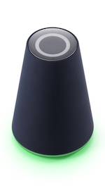

# 조명

클라이언트 기기는 [클라이언트 상태, 이벤트](/Design/Client_State_And_Event.md) 그리고 사용자 요청에 대한 피드백 등을 표현하기 위해 조명을 제공해야 합니다. 클라이언트가 사용자에게 어떤 조명을 어떻게 제공해야 하는지 설명합니다.

* [조명 색상](#LightColor)
* [조명 효과](#LightEffect)
* [조명 가이드라인](#LightGuideline)

## 조명 색상 {#LightColor}

클라이언트는 다음과 같은 조명 색상을 사용해야 합니다.

| 조명 색상     | RGB 값                | 설명                                   | 필수 여부 |
|-------------|----------------------|---------------------------------------|:--------:|
| Green       | &#9724; 5, 214, 134(#05D686)   | 사용자의 음성 입력 수신                                  | 필수  |
| Yellow Green | &#9724; 150, 255, 0(#96FF00)    | Clova 알림(Notification)                             | 필수  |
| Red         | &#9724; 255, 0, 0(#FF0000)      | 마이크 음소거, 네트워크 연결 오류, 배터리 부족 등의 오류 상황     | 필수  |
| Warm White   | &#9724; 240, 230, 230(#F0E6E6)  | 스피커를 통한 Clova 음성 출력, 알람/리마인더/타이머 이벤트 수신                             | 필수  |

다음은 Wave의 조명 색상 적용 사례입니다.

<table style="width:600px;">
  <thead>
    <tr>
      <th style="width:150px;">Green</th>
      <th style="width:150px;">Yellow Green</th>
      <th style="width:150px;">Red</th>
      <th style="width:150px;">Warm White</th>
    </tr>
  </thead>
  <tbody>
    <tr>
      <td></td>
      <td></td>
      <td></td>
      <td></td>
    </tr>
  </tbody>
</table>

## 조명 효과 {#LightEffect}

조명 효과는 [조명 색상](#LightColor)이 전달하는 의미를 바탕으로 좀 더 상세한 의미나 상태를 전달하는 용도로 사용됩니다.

다음은 클라이언트 기기 구현 시 조명이 나타내야 할 조명 효과와 이에 대한 설명 및 예시를 제공하는 표입니다.

| 조명 효과                            | 설명                                      | 예시                                                               |
|------------------------------------|------------------------------------------|-------------------------------------------------------------------|
| 점등(Lights up)                     | 특별한 효과 없이 조명을 바로 켠 상태로 전환합니다.   |               |
| 천천히 점멸 반복(Repeat pulse)         | 조명의 조도를 천천히 높였다가 낮추는 것을 반복합니다. |   |
| 천천히 소등(Fade out)                 | 조명의 조도를 천천히 낮추면서 마지막에 조명을 끕니다. |              |
| 물결 표현 반복(Repeat Splash)          | 조명이 좌우로 출렁이는 물결이 느껴지도록 조명 효과를 반복합니다. |          |

다음은 클라이언트의 [상태 및 이벤트](/Design/Client_State_And_Event.md)를 조명으로 어떻게 표현해야 하는지 나타낸 표입니다.

| 상태 또는 이벤트               | 조명 효과 적용                | 필수 여부 |
|----------------------------|----------------------------|:---------:|
| Attending, listening 상태     | Green 조명 점등              | 필수     |
| End 상태                    | Warm White 조명 천천히 소등     | 필수     |
| Error 상태                  | Red 조명 천천히 점멸 반복       | 필수     |
| Mute on 상태                | Red 조명 점등                | 필수     |
| Processing & reporting 상태 | Warm White 조명 천천히 점멸 반복 | 필수     |
| Mute on 상태 해제            | Red 조명 천천히 소등           | 필수     |
| 대기 시간 초과한 직후           | Green 조명 천천히 소등

<strong>Note!</strong>

이 이벤트에 대한 조명 효과는 더 이상 필수 구현이 아니면 구현 항목에서 사라질 예정입니다.

         | 선택     |
| 알람, 리마인더, 타이머 시작      | Warm White 조명 물결 표현 반복  | 선택     |

## 조명 가이드라인 {#LightGuideline}

조명을 제공할 때 다음과 같은 사항을 따라야 합니다.
  - 1 미터 내의 거리에서 시력이 0.7인 사람이 [조명 색상](#LightColor)을 구분할 수 있어야 합니다.
  - 조명 색상에 정의된 의미 외에 다른 상태나 의미를 적용하지 않을 것을 권고합니다.
  - 사용자가 그래픽 RGB 값의 색과 조명 색상이 동일하다고 인지할 수 있도록 조명 색상을 적용해야 합니다.
  - 필수로 표현해야 하는 [조명 효과](#LightEffect) 외에도 기기 부팅, 스피커 볼륨 조절, 충전 상태, 버튼 피드백과 같이 상황에 적절하거나 제조사의 UX 정책에 따라 조명 색상과 조명 효과를 추가할 수 있습니다.
  - 하나의 조명 색상이나 효과에 너무 많은 의미나 상태를 표현하지 않을 것을 권고합니다.
  - 화면이 제공되지 않는 기기는 조명의 밝기 등을 이용하여 기기의 스피커 볼륨 수준을 표시할 것을 권고합니다.
  - 이동이 가능한 배터리 탑재 모델은 배터리 충전 상태를 조명으로 파악할 수 있게 구현할 것을 권고합니다.
